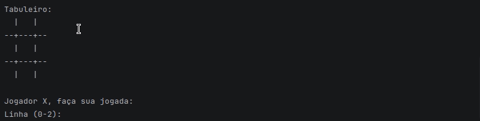

# 🎮 Jogo da Velha em Java

Projeto desenvolvido como **trabalho de conclusão de Lógica de Programação - Módulo I do curso de Java - Ada Ser+ Tech**.

---

## 📌 Descrição

Este projeto consiste em uma implementação simples do clássico **Jogo da Velha** utilizando a linguagem **Java**, com execução via terminal (console).

O jogo permite que dois jogadores se alternem entre as jogadas até que haja um vencedor ou ocorra empate.

---

## 🎥 Demonstração



---

## 🚀 Funcionalidades

- Tabuleiro 3x3 exibido no console
- Dois jogadores (X e O)
- Validação de jogadas (não permite sobrescrever posições)
- Verificação automática de vitória
- Detecção de empate

---

## 🛠️ Tecnologias utilizadas

- Java
- IntelliJ IDEA

---

## ▶️ Como executar o projeto

1. Clone o repositório:
```bash
git clone https://github.com/andreluialves/jogo-da-velha-ada.git
```
2. Acesse a pasta do projeto:
```bash
cd nome-do-projeto
```
3. Compile o arquivo:
```bash
javac JogoDaVelha.java
```
4. Execute o programa:
```bash
java JogoDaVelha
```

## 👥 Participantes
- André Luiz Alves
- Adriana Selestrina
- Jônatas Ferreira

💡 Alguns participantes também optaram por realizar forks do projeto com o objetivo de aprofundar os estudos, testar melhorias e evoluir a implementação de forma individual.

## 📚 Aprendizados
Durante o desenvolvimento deste projeto, foram aplicados conceitos como:

- Estruturas de repetição (while, for)
- Estruturas condicionais (if/else)
- Arrays bidimensionais (matriz)
- Métodos e organização de código
- Entrada de dados com Scanner
- Criação e gerenciamento de *issues* para organização das tarefas
- Uso de *Conventional Commits* para padronização do versionamento

## 📄 Licença
Este projeto foi desenvolvido para fins educacionais.